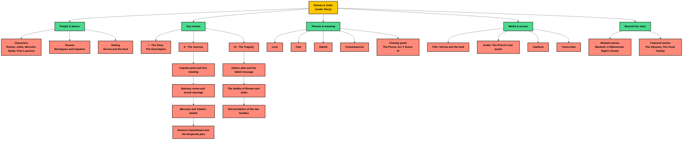

# Information Architecture

Content organisation for the Romeo & Juliet story. The three chapters live under **Story** (see `sitemap.md` for pages).

```mermaid
flowchart TD
    A["Romeo & Juliet<br/>(under Story)"]

    A --> P["People & places"]
    A --> E["Key events"]
    A --> T["Themes & meaning"]
    A --> M["Media & access"]
    A --> R["Beyond the story"]

    P --> P1["Characters<br/>Romeo, Juliet, Mercutio,<br/>Tybalt, Friar Laurence"]
    P --> P2["Houses<br/>Montagues and Capulets"]
    P --> P3["Setting<br/>Verona and the feud"]

    E --> E1["I · The Story<br/>The feud begins"]
    E --> E2["II · The Journey"]
    E --> E3["III · The Tragedy"]

    E2 --> E2a["Capulet party and first meeting"]
    E2a --> E2b["Balcony scene and secret marriage"]
    E2b --> E2c["Mercutio and Tybalt's deaths"]
    E2c --> E2d["Romeo's banishment and<br/>the desperate plan"]

    E3 --> E3a["Juliet's plan and the failed message"]
    E3a --> E3b["The deaths of Romeo and Juliet"]
    E3b --> E3c["Reconciliation of the two families"]

    T --> T1["Love"]
    T --> T2["Fate"]
    T --> T3["Hatred"]
    T --> T4["Consequences"]
    T --> T5["Closing quote<br/>The Prince, Act V Scene III"]

    M --> M1["Film: Verona and the feud"]
    M --> M2["Audio: The Prince's last words"]
    M --> M3["Captions"]
    M --> M4["Transcripts"]

    R --> R1["Related stories<br/>Macbeth, A Midsummer Night's Dream"]
    R --> R2["Featured stories<br/>The Odyssey, The Great Gatsby"]

    classDef root fill:#FFC800,stroke:#000,stroke-width:2px,color:#000,font-weight:bold
    classDef group fill:#4CD98E,stroke:#000,stroke-width:2px,color:#000
    classDef content fill:#FF8A7A,stroke:#000,stroke-width:2px,color:#000

    class A root
    class P,E,T,M,R group
    class P1,P2,P3,E1,E2,E3,E2a,E2b,E2c,E2d,E3a,E3b,E3c,T1,T2,T3,T4,T5,M1,M2,M3,M4,R1,R2 content
```
