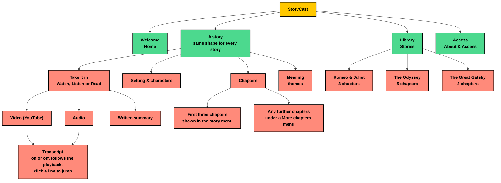

# Information Architecture

How content is organised. Every story uses the same shape, so a reader who has used one can use any of them.

```mermaid
flowchart TD
    A["StoryCast"]

    A --> W["Welcome<br/>Home"]
    A --> L["Library<br/>Stories"]
    A --> S["A story<br/>same shape for every story"]
    A --> X["Access<br/>About & Access"]

    S --> S1["Take it in<br/>Watch, Listen or Read"]
    S --> S2["Setting & characters"]
    S --> S3["Chapters"]
    S --> S4["Meaning<br/>themes"]

    S1 --> S1a["Video (YouTube)"]
    S1 --> S1b["Audio"]
    S1 --> S1c["Written summary"]
    S1a --> T["Transcript<br/>on or off, follows the playback,<br/>click a line to jump"]
    S1b --> T

    S3 --> S3a["First three chapters<br/>shown in the story menu"]
    S3 --> S3b["Any further chapters<br/>under a More chapters menu"]

    L --> R1["Romeo & Juliet<br/>3 chapters"]
    L --> R2["The Odyssey<br/>5 chapters"]
    L --> R3["The Great Gatsby<br/>3 chapters"]

    classDef root fill:#FFC800,stroke:#000,stroke-width:2px,color:#000,font-weight:bold
    classDef group fill:#4CD98E,stroke:#000,stroke-width:2px,color:#000
    classDef content fill:#FF8A7A,stroke:#000,stroke-width:2px,color:#000

    class A root
    class W,L,S,X group
    class S1,S2,S3,S4,S1a,S1b,S1c,T,S3a,S3b,R1,R2,R3 content
```
