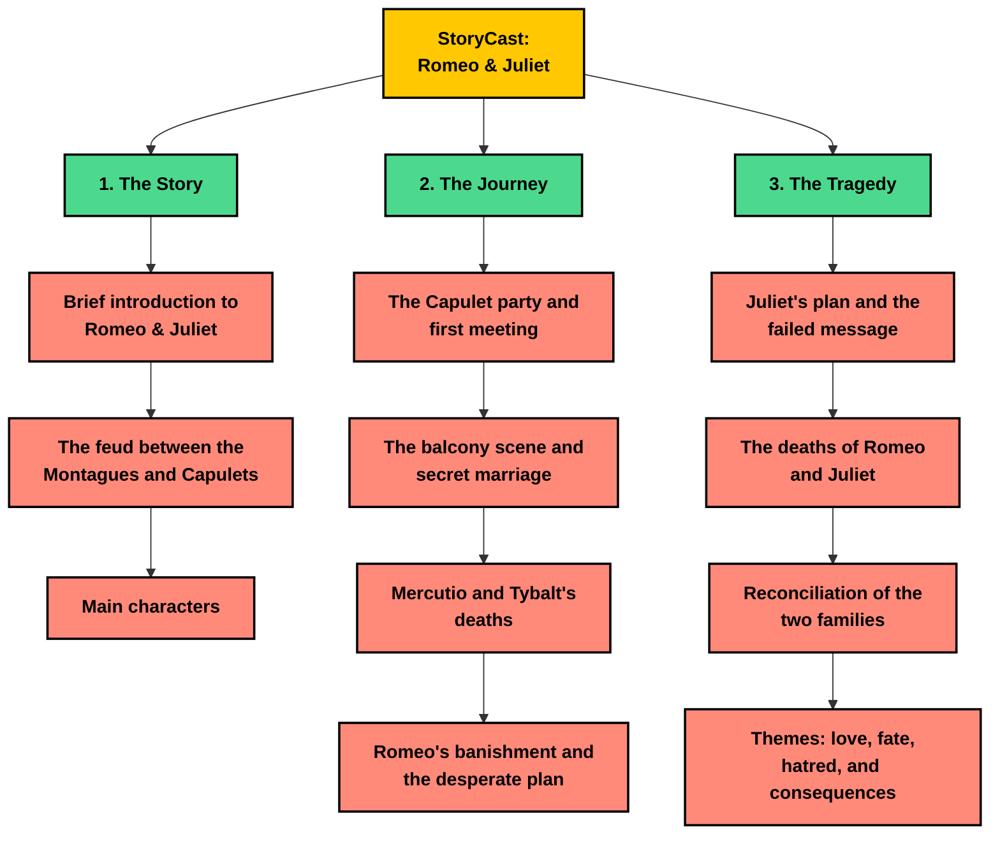

# Information Architecture

```mermaid
flowchart TD
    A["StoryCast:<br/>Romeo & Juliet"]

    A --> B["1. The Story"]
    A --> C["2. The Journey"]
    A --> D["3. The Tragedy"]

    B --> B1["Brief introduction to<br/>Romeo & Juliet"]
    B1 --> B2["The feud between the<br/>Montagues and Capulets"]
    B2 --> B3["Main characters"]

    C --> C1["The Capulet party and<br/>first meeting"]
    C1 --> C2["The balcony scene and<br/>secret marriage"]
    C2 --> C3["Mercutio and Tybalt's<br/>deaths"]
    C3 --> C4["Romeo's banishment and<br/>the desperate plan"]

    D --> D1["Juliet's plan and the<br/>failed message"]
    D1 --> D2["The deaths of Romeo<br/>and Juliet"]
    D2 --> D3["Reconciliation of the<br/>two families"]
    D3 --> D4["Themes: love, fate,<br/>hatred, and consequences"]

    classDef root fill:#FFC800,stroke:#000,stroke-width:2px,color:#000,font-weight:bold
    classDef section fill:#4CD98E,stroke:#000,stroke-width:2px,color:#000
    classDef page fill:#FF8A7A,stroke:#000,stroke-width:2px,color:#000

    class A root
    class B,C,D section
    class B1,B2,B3,C1,C2,C3,C4,D1,D2,D3,D4 page
```
