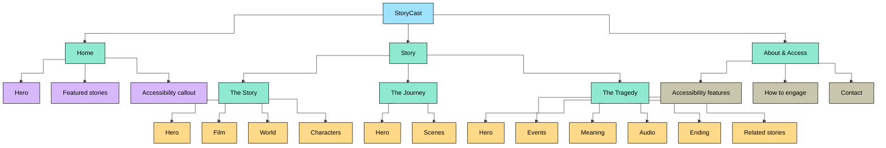

# Sitemap

```mermaid
%%{init: {"flowchart": {"curve": "step", "nodeSpacing": 30, "rankSpacing": 50}}}%%
flowchart TD
    ROOT["StoryCast"]

    ROOT --> HOME["Home"]
    ROOT --> STORY["Story"]
    ROOT --> ABOUT["About & Access"]

    HOME --> H1["Hero"]
    HOME --> H2["Featured stories"]
    HOME --> H3["Accessibility callout"]

    STORY --> S1["The Story"]
    STORY --> S2["The Journey"]
    STORY --> S3["The Tragedy"]

    S1 --> S1a["Hero"]
    S1 --> S1b["Film"]
    S1 --> S1c["World"]
    S1 --> S1d["Characters"]

    S2 --> S2a["Hero"]
    S2 --> S2b["Scenes"]

    S3 --> S3a["Hero"]
    S3 --> S3b["Events"]
    S3 --> S3c["Meaning"]
    S3 --> S3d["Audio"]
    S3 --> S3f["Ending"]
    S3 --> S3e["Related stories"]

    ABOUT --> A1["Accessibility features"]
    ABOUT --> A2["How to engage"]
    ABOUT --> A3["Contact"]

    classDef root fill:#9ee3fb,stroke:#000,color:#000
    classDef section fill:#8ee9d0,stroke:#000,color:#000
    classDef home fill:#d6b8fb,stroke:#000,color:#000
    classDef chapter fill:#ffd98a,stroke:#000,color:#000
    classDef about fill:#c9c6ae,stroke:#000,color:#000

    class ROOT root
    class HOME,STORY,ABOUT,S1,S2,S3 section
    class H1,H2,H3 home
    class S1a,S1b,S1c,S1d,S2a,S2b,S3a,S3b,S3c,S3d,S3e,S3f chapter
    class A1,A2,A3 about
```
