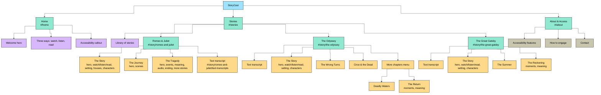

# Sitemap

Pages and routes. Every story follows the same pattern: a story home (`the-story`) with the media options, setting and characters, then its chapters.

```mermaid
%%{init: {"flowchart": {"curve": "step", "nodeSpacing": 30, "rankSpacing": 50}}}%%
flowchart TD
    ROOT["StoryCast"]

    ROOT --> HOME["Home<br/>#/home"]
    ROOT --> STORIES["Stories<br/>#/stories"]
    ROOT --> ABOUT["About & Access<br/>#/about"]

    HOME --> H1["Welcome hero"]
    HOME --> H2["Three ways: watch, listen, read"]
    HOME --> H3["Accessibility callout"]

    STORIES --> L1["Library of stories"]
    STORIES --> RJ["Romeo & Juliet<br/>#/story/romeo-and-juliet"]
    STORIES --> OD["The Odyssey<br/>#/story/the-odyssey"]
    STORIES --> GG["The Great Gatsby<br/>#/story/the-great-gatsby"]

    RJ --> RJ1["The Story<br/>hero, watch/listen/read, setting, houses, characters"]
    RJ --> RJ2["The Journey<br/>hero, scenes"]
    RJ --> RJ3["The Tragedy<br/>hero, events, meaning, audio, ending, more stories"]

    RJ --> RJ4["Text transcript<br/>#/story/romeo-and-juliet/text-transcripts"]
    OD --> OD7["Text transcript"]
    GG --> GG4["Text transcript"]

    OD --> OD1["The Story<br/>hero, watch/listen/read, setting, characters"]
    OD --> OD2["The Wrong Turns"]
    OD --> OD3["Circe & the Dead"]
    OD --> OD4["More chapters menu"]
    OD4 --> OD5["Deadly Waters"]
    OD4 --> OD6["The Return<br/>moments, meaning"]

    GG --> GG1["The Story<br/>hero, watch/listen/read, setting, characters"]
    GG --> GG2["The Summer"]
    GG --> GG3["The Reckoning<br/>moments, meaning"]

    ABOUT --> A1["Accessibility features"]
    ABOUT --> A2["How to engage"]
    ABOUT --> A3["Contact"]

    classDef root fill:#9ee3fb,stroke:#000,color:#000
    classDef section fill:#8ee9d0,stroke:#000,color:#000
    classDef home fill:#d6b8fb,stroke:#000,color:#000
    classDef chapter fill:#ffd98a,stroke:#000,color:#000
    classDef about fill:#c9c6ae,stroke:#000,color:#000

    class ROOT root
    class HOME,STORIES,ABOUT,RJ,OD,GG section
    class H1,H2,H3,L1 home
    class RJ1,RJ2,RJ3,RJ4,OD7,GG4,OD1,OD2,OD3,OD4,OD5,OD6,GG1,GG2,GG3 chapter
    class A1,A2,A3 about
```
